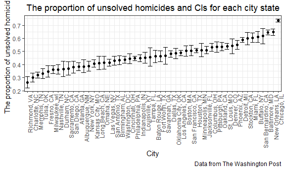

p8105\_hw5\_hq2163\_hanbo
================
Hanbo Qiu
November 3, 2018

Problem 1
---------

**Start with a dataframe containing all file names:**

``` r
vec_names = list.files("./data", all.files = TRUE, full.names = FALSE) 

vec_names = vec_names[-1:-2]
```

**Iterate over file names, read in data for each subject, and save the result as a new variable in the dataframe**

``` r
df_names = as_tibble(vec_names) %>% 
  mutate(path_names = str_c( "./data/", vec_names), 
         data = map(.x = path_names, ~read_csv(file = .x, col_types = "dddddddd"))) %>% 
  select(-path_names)
```

**Tidy the result; manipulate file names to include control arm and subject ID; make the observations “tidy”**

``` r
df_names = df_names %>% 
  mutate(group = str_sub(value, 1, 3), no = 1:20) %>% 
  unnest() %>% 
  gather(key = week, value = value, week_1: week_8)
```

**Make a spaghetti plot showing observations on each subject over time, and comment on differences between groups**

``` r
df_names %>% 
  ggplot(aes(x = week, y = value, color = group, group = no)) +
  geom_path() + 
  labs(
    title = "Individual observations of two groups on each subject in 8 weeks",
    x = "Week",
    y = "Individual observations",
    caption = "Data from a longitudinal study"
    ) +
  theme(legend.position = "right")
```


Problem 2
---------

**Describe the raw data. Create a city\_state variable, summarize within cities to obtain the total number of homicides and the number of unsolved homicides**

``` r
homicides = read_csv(file = "./homicide-data.csv") %>% 
   mutate(city_state = str_c(city, ", ", state))
## Parsed with column specification:
## cols(
##   uid = col_character(),
##   reported_date = col_integer(),
##   victim_last = col_character(),
##   victim_first = col_character(),
##   victim_race = col_character(),
##   victim_age = col_character(),
##   victim_sex = col_character(),
##   city = col_character(),
##   state = col_character(),
##   lat = col_double(),
##   lon = col_double(),
##   disposition = col_character()
## )

total_homi = homicides %>% 
   group_by(city_state) %>% 
   summarize(total_num = n())

unsolved_homi = homicides %>% 
   filter(disposition %in% c("Open/No arrest", "Closed without arrest")) %>% 
   group_by(city_state) %>% 
   summarize(unsolved_num = n())
```

The raw data is collected by The Washington Post to represent a decade of homicide arrest data from 50 of the nation’s largest cities. The dataframe's dimension is 52179\*13. In each observation, we can figure out the basic information of the victim in each case of homicide. In "disposition" variable, the case was catagorized into "Closed by arrest", "Closed without arrest" and "Open/No arrest". After importing the data, we create a `city_state` variable to combine `city` and `state` variables, summarize within cities to obtain the total number of homicides which is stored in the subset `total_homi` and the number of unsolved homicides in the subset `unsolved_homi`.

**For the city of Baltimore, MD, use the prop.test function to estimate the proportion of homicides that are unsolved; save the output of prop.test as an R object, apply the broom::tidy to this object and pull the estimated proportion and confidence intervals from the resulting tidy dataframe.**

``` r
all_homi = inner_join(unsolved_homi, total_homi, by = "city_state" )

baltimore_homi = filter(all_homi, city_state == "Baltimore, MD")

prop.test(baltimore_homi[[2]], baltimore_homi[[3]]) %>% 
  broom::tidy(result) %>% 
  mutate(city_state = "Baltimore, MD") %>% 
  select(city_state, estimate, conf.low, conf.high ) %>% 
  knitr::kable(col.names = c("City", "Estimate", "Conf.low", "Conf.high"),
               digits = 3)
```

| City          |  Estimate|  Conf.low|  Conf.high|
|:--------------|---------:|---------:|----------:|
| Baltimore, MD |     0.646|     0.628|      0.663|

The table above shows the estimated proportion and confidence interval of homicides in Baltimore, MD.

**Now run prop.test for each of the cities in your dataset, and extract both the proportion of unsolved homicides and the confidence interval for each. Do this within a “tidy” pipeline, making use of purrr::map, purrr::map2, list columns and unnest as necessary to create a tidy dataframe with estimated proportions and CIs for each city.**

``` r
test = function(n_unsolve, n_total) {
  prop.test(n_unsolve, n_total) %>% 
  broom::tidy(test) %>% 
  select(estimate, conf.low, conf.high)
}
 
all_result = map2_dfr(.x = all_homi[[2]], .y =  all_homi[[3]], ~test(n_unsolve = .x, n_total = .y)) %>%
  bind_cols(all_homi) %>%
  select(city_state, estimate:conf.high) %>% 
  janitor::clean_names()
```

We make a function `test` to produce estimate and CI, and iterate over for each of the cities in dataset. Then we extract both the proportion of unsolved homicides and the confidence interval from results to store them in a dataframe named `all_result`.

**Create a plot that shows the estimates and CIs for each city state check out geom\_errorbar for a way to add error bars based on the upper and lower limits. Organize cities according to the proportion of unsolved homicides.**

``` r
all_result %>% 
  mutate(city_state = fct_reorder(city_state, estimate)) %>% 
  ggplot(aes(x = city_state, y = estimate)) +
  geom_point() +
  geom_errorbar(mapping = aes(ymax = conf_high, ymin = conf_low)) +
  labs(
    title = "The proportion of unsolved homicides and CIs for each city state",
    x = "City",
    y = "The proportion of unsolved homicides",
    caption = "Data from The Washington Post"
  ) +
  theme(axis.text.x = element_text(angle = 90, hjust = 1))
```


